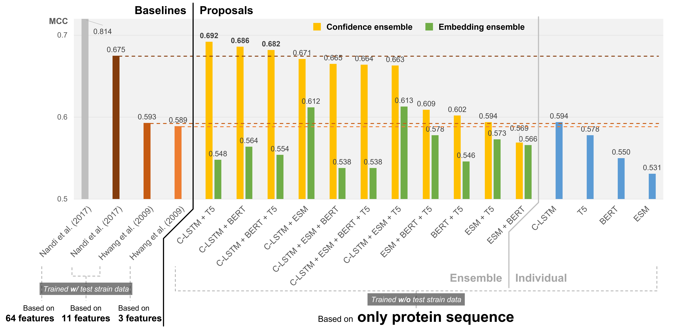

# Bacterial Essential Protein Prediction Based on Sequence

## Introduction
This repository provides the source codes and example datasets that reproduce the test environments for each model introduced in the paper, *"Predicting Bacterial Essential Genes Based on Protein Sequence Only"*, as well as gene essentiality datasets for individual strains. Users can utilize the example code and data to implement protein sequence embedding and essential gene prediction, and can perform predictions on their own data with minor modifications to the provided example codes.

## Key Features

- **Protein Sequence Is All You Need**: Predict bacterial essential genes using only their protein sequences without integration of complex multi-feature data.
- **Extended Bacterial Essential Gene Dataset**: Experimental essentiality data (features: *'essentiality', 'protein_seq', 'dna_seq', 'genome_id', 'locus_tag', etc.*) of approximately *280,000 bacterial genes* collected from 79 studies.

## Model Performances



## Repository Structure

- **`data/raw_data/`**: Essential gene datasets (include non-essential genes) of each strain.
- **`data/test_exam/`**: Example test datasets consisting of genes from *E. coli* Keio collection.
- **`models/`**: Models to predict essential genes (*'classifier ~'*) or encode protein sequences (*'embed_custom'*).
- **`results/`**: Model evaluation, prediction results and model training history.
- **`sources/`**: Jupyter notebook codes for sequence embedding (*'emb ~'*) or model test and prediction (*'test ~'*).

## How to Use

1. **Clone the repository**:
   ```bash
   git clone https://github.com/sblabkribb/essprotseq.git
   cd deessgene
   ```

2. **Install dependencies**:
   ```bash
   pip install -r requirements.txt
   ```

3. **Set options (data_path, etc.) in each source code**:
   ```python
   # Set options (example of 'test-indiv_class.ipynb')
   embed_ver = ["clstm", "esm2", "bert", "t5"]
   data_path = "../data/test_exam/"
   model_path = f"../models/classifier_indiv/"
   result_path = f"../results/"
   ```
4. **Run the source code**


## Citation

To cite this work, please reference:
```
Seongbo Heo et al. "Predicting Bacterial Essential Genes Based on Protein Sequence Only" Synthetic Biology Research Center, KRIBB.
```

## Acknowledgments

This project was supported by the **Korea Research Institute of Bioscience and Biotechnology (KRIBB)** and the **National Research Foundation of Korea**.

